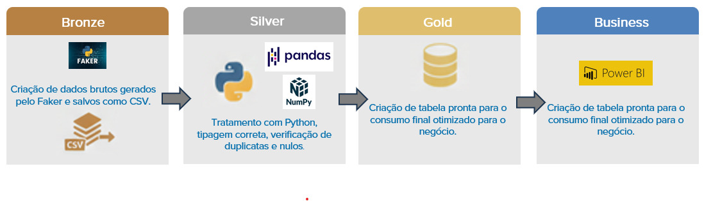
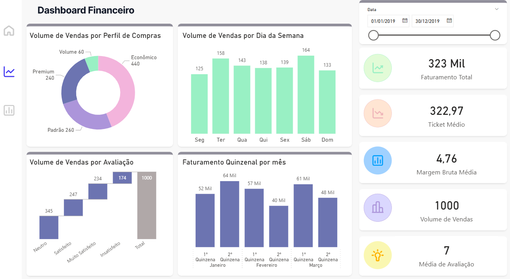

# 🛒 Projeto ETL - Arquitetura Medalhão: Análise de Vendas de Supermercado

## 🏗️ Arquitetura do Pipeline
O projeto utiliza a **Medallion Architecture**, organizando os dados em diferentes estágios de maturidade para garantir a integridade e facilitar a análise de negócio.

  

---

## 🎯 Objetivo do Projeto

O foco deste projeto é transformar dados transacionais brutos em uma base de dados estratégica e higienizada. Através deste pipeline, resolvemos problemas de dados fragmentados ao:

1.  **Padronizar** colunas e categorias (Tradução completa para PT-BR).
2.  **Enriquecer** o dataset com colunas de inteligência temporal (períodos, quinzenas, dias úteis).
3.  **Auditar** a qualidade dos dados (remoção de nulos e duplicatas) antes da geração de métricas.

---

## 📊 Visualização dos Resultados (Dashboard)

Após o processamento das camadas, os dados da camada **Gold** foram utilizados para alimentar este Dashboard, permitindo uma visão 360º da operação:

  

---

## 📂 Fluxo do Pipeline (Workflow)

O pipeline é automatizado através de scripts Python. Você pode executá-lo seguindo esta ordem no terminal:

### 🥉 1. Camada Bronze (Ingestão)
Executada pelo script `scripts/geradados.py`.
- **Ação:** Gera 1.000 registros sintéticos utilizando a biblioteca `Faker`.
- **Output:** `data/bronze/supermarket_sales_raw.csv`.

### 🥈 2. Camada Silver (Tratamento)
Executada pelo script `scripts/processamento_silver.py`.
- **Ação:** Tradução de colunas, conversão de tipos (datetime) e criação de variáveis como `periodo_dia` e `quinzena`.
- **Output:** `data/silver/supermarket_sales_clean.csv`.

### 🥇 3. Camada Gold (Agregação de Negócio)
Executada pelo script `scripts/analise_gold.py`.
- **Ação:** Criação de tabelas agregadas prontas para BI (vendas por categoria, comportamento do cliente, performance por filial).
- **Output:** Arquivos CSV na pasta `data/gold/`.

---

## 📈 Principais Insights Gerados

Com os dados processados na Gold, identificamos métricas críticas:

* **Picos de Venda:** Identificação de faturamento maior aos sábados e no período da tarde.
* **Ticket Médio:** Controle de gasto médio por categoria de produto (ex: Eletrônicos vs Alimentos).
* **Fidelidade:** Diferença de comportamento de compra entre clientes membros e casuais.
* **Satisfação:** Monitoramento de avaliações (Rating) por filial para melhoria de processos.

---

## 🛠️ Tecnologias Utilizadas

* **Python 3.12**
* **Pandas & Numpy:** Manipulação e processamento.
* **Faker:** Geração de dados simulados.
* **Matplotlib & Seaborn:** EDA (Análise Exploratória de Dados).
* **Power BI:** Visualização e Dashboard.
* **Git:** Controle de versão.

---
Desenvolvido por [Amanda]
